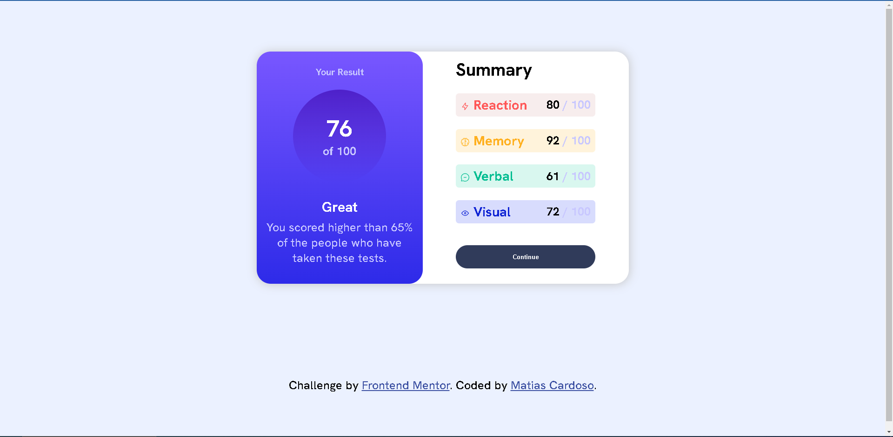

# Frontend Mentor - Results summary component solution

This is a solution to the [Results summary component challenge on Frontend Mentor](https://www.frontendmentor.io/challenges/results-summary-component-CE_K6s0maV). Frontend Mentor challenges help you improve your coding skills by building realistic projects. 

### The challenge

Users should be able to:

- View the optimal layout for the interface depending on their device's screen size
- See hover and focus states for all interactive elements on the page

### Screenshot

### Links

- Solution URL: [Add solution URL here](https://your-solution-url.com)
- Live Site URL: [Add live site URL here](https://your-live-site-url.com)

### Built with

-  HTML5 
- CSS custom properties
- Flexbox
- CSS Grid
- Mobile-first workflow

### What I learned

I learned in a certain way to accommodate the elements on the screen of a mobile device, although it is not the best way to do it.

### Continued development

I would like to improve in responsive design

### Useful resources

- [Example resource 1](https://web.dev/responsive-web-design-basics/) - This helped me understand a little more about responsive design.

## Author

- Website - [Add your name here](https://github.com/MatiasC5)
- Frontend Mentor - [@yourusername](https://www.frontendmentor.io/profile/MatiasC5)

